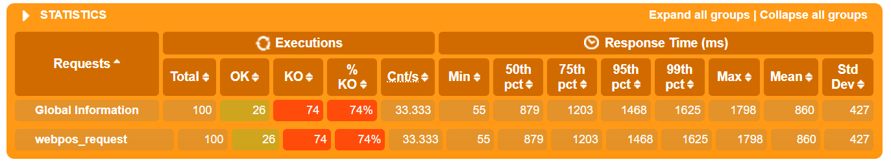

# WebPOS

The demo shows a web POS system , which replaces the in-memory product db in aw03 with a one backed by 京东.


To run

```shell
mvn clean spring-boot:run
```

Currently, it creates a new session for each user and the session data is stored in an in-memory h2 db. 
And it also fetches a product list from jd.com every time a session begins.

1. Build a docker image for this application and performance a load testing against it.
2. Make this system horizontally scalable by using haproxy and performance a load testing against it.
3. Take care of the **cache missing** problem (you may cache the products from jd.com) and **session sharing** problem (you may use a standalone mysql db or a redis cluster). Performance load testings.

Please **write a report** on the performance differences you notices among the above tasks.

# scale up

run webpos in one docker image, without cache, tested by Gatling

cpus=0.5:


cpus=1:


cpus=2:


We can see that as number of cpus increase, response time decrease.

# scale out

run webpos in 4 docker images, using haproxy as load balancer, tested by Gatling

> if I don't use cache, 500 ERROR will happen when calling parseJD, and Gatling will fail about 50%~70%.
> 
> if I use cache on JD::getProducts, 500 ERROR will happen less frequently, but Gatling will fail about 50%.

no cache: 



cache: 


We can see cache accelerates our program.

# redis

I use redis in docker to handle **cache missing** problem and **session sharing** problem.

run webpos in 4 docker images, using haproxy as load balancer:

redis cluster (3 masters + 3 slavers) in wsl2:

first time:


second time:


It seems that reading cache from redis in wsl is slower than reading resources from JD.